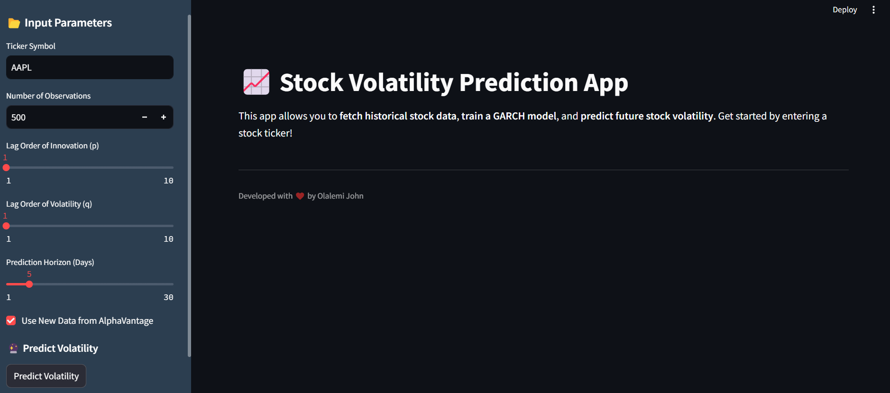
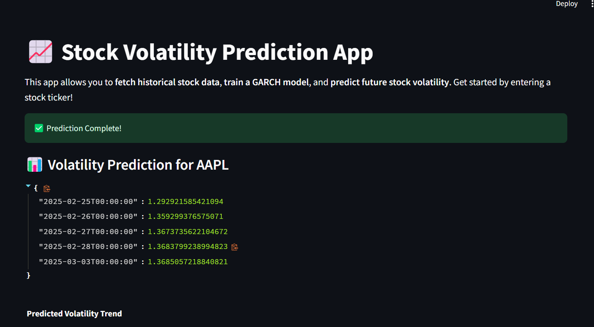
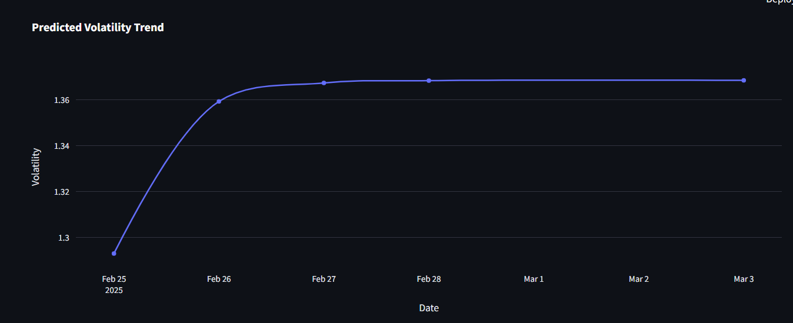

# Stock Volatility Prediction App

## 📄 Description
The **Stock Volatility Prediction App** is a web-based application that leverages machine learning to predict stock price volatility. The app provides an intuitive interface for users to visualize stock trends, analyze market data, and make informed decisions based on predictive analytics.

## 🚀 Features
- Real-time stock data visualization
- Machine learning model for volatility prediction
- User-friendly interface built with Streamlit
- API integration with Alpha Vantage
- Interactive graphs and data insights

## 📦 Installation
To set up the app locally, follow these steps:

```bash
# Clone the repository
git clone https://github.com/yourusername/stock-volatility-prediction-APP.git

# Navigate to the project directory
cd stock-volatility-prediction-APP

# Create a virtual environment
python -m venv venv

# Activate the virtual environment
# On Windows
venv\Scripts\activate
# On macOS/Linux
source venv/bin/activate

# Install required packages
pip install -r requirements.txt

# Run the app
uvicorn main:app --reload
```

## 📸 Screenshots
Below are some screenshots of the app:


*Dashboard showing stock trends and predictions.*


*Stock price volatility prediction view.*

*Stock price volatility prediction view.*

## 🛠 Technologies Used
- **Python**: FastAPI, Pydantic, Uvicorn
- **Frontend**: Streamlit
- **Machine Learning**: scikit-learn, pandas, numpy
- **Data Visualization**: matplotlib, seaborn

## 📄 License
This project is licensed under the MIT License.

## 👨‍💻 Author
Developed by Olalemi John
📧 Email: johnolalemi90@gmail.com
🔗 LinkedIn: linkedin.com/in/john-olalemi
